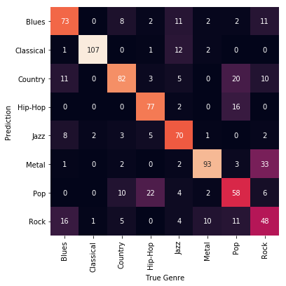

# Music Genre Classification using Artificial Neural Networks

[spotify]:  https://www.spotify.com/
[developer]: https://developer.spotify.com/
[Spotify Web API]: https://developer.spotify.com/documentation/web-api/
[python]: https://www.python.org/
[tensorflow]: https://www.tensorflow.org/
[keras]: https://keras.io/
[NumPy]: https://numpy.org/
[pandas]: https://pandas.pydata.org/
[matplotlib]: https://matplotlib.org/
[scikit-learn]: https://scikit-learn.org/0.21/
[echonest]: http://the.echonest.com/
[seaborn]: https://seaborn.pydata.org/
[spotipy]:  https://spotipy.readthedocs.io/en/2.9.0/

This repository provides code for musical genre recognition with convolutional neural networks.
Below the abstract from the paper.

> Music genre recognition is a promising field of research in the area of music information retrieval (MIR). Genre classifiers have many real world applications, e.g. as a way to automatically tag large data sets suited as inputs to recommender systems. In this paper we propose a way to sample song data with the Spotify API and create a music genre classifier using artificial neural networks. We compare different feature sets to each other and evaluate their performance and accuracy using confusion matrices and more sophisticated metrics like F1 scores. We show that convolutional neural networks using timbre values perform well on this task and also propose ways to handle class imbalance.

## Packages
* [Python] 3.7.5
* [Tensorflow] - 1.14.0
* [Keras] - 2.3.1
* [NumPy] - 1.16.2
* [Pandas] - 0.25.3
* [matplotlib] - 3.0.3
* [seaborn] 0.9.0
* [scikit-learn] - 0.21.3 
* [spotipy] - 2.4.4

## Data

[data_acquisition]:   https://nbviewer.jupyter.org/github/abuchmueller/DeepMusic/blob/master/data_acquisiton.ipynb

The data used in our models was aquired from [Spotify]. It contains audio features provided by [Echo Nest]. To make authorized calls to the [Spotify Web API] you will need access to a Spotify [developer] account. A guide on how to access can be found [here](https://spotipy.readthedocs.io/en/2.9.0/#getting-started). The approach and used playlists are detailed in the [data_acquisition] notebook. Note however that the playlists change constantly so you will probably be unable to pull exactly the same data.

## Code & Usage

This repository contains the following notebooks:

1. [data_acquisition]: shows how to sample your own song data from [Spotify] with [spotipy].
2. [data_prep]: pre-processing of the data for our neural networks. Used to extract timbre values and pitch for each track.
3. [c1m1]: 1D Convolutional neural network approach using timbre vectors.
4. [c1m2]: 1D Convolutional neural network approach using pitch vectors.
5. [c2m1]: 2D Convolutional neural network approach using matrices combining timbre and pitch vectors.

[data_prep]:   https://nbviewer.jupyter.org/github/abuchmueller/DeepMusic/blob/master/data_prep.ipynb
[c1m1]:   https://nbviewer.jupyter.org/github/abuchmueller/DeepMusic/blob/master/c1m1.ipynb
[c1m2]:   https://nbviewer.jupyter.org/github/abuchmueller/DeepMusic/blob/master/c1m2.ipynb
[c2m1]:   https://nbviewer.jupyter.org/github/abuchmueller/DeepMusic/blob/master/c2m1.ipynb

Building a genre classifier with Keras can be broken down into three steps.

#### Sampling data & pre-processing into Numpy arrays

This is done in the [data_acquisition] and [data_prep] notebooks. You may skip the last step of the [data_prep] notebook (reducing raw data to Numpy arrays) but note that your raw data can get very large quickly. Our sample of approximately 10.000 tracks has a size of 4GB. By extracting only timbre and pitch vectors and compressing into a .npz file, we were able to cut the size down to 600MB.

#### Building models

This is done in the [c1m1], [c1m2] and [c1m2] notebooks. All models are multi-layered CNN's. You may choose your own architecture, add more layers or filters and choose a differenz optimizer. 

#### Diagnostics & Visualizing results

Also done in the [c1m1], [c1m2] and [c1m2] notebooks. You'll need [seaborn] and [scikit-learn] to create confusion matrices similarly to ours. Below an example of our [timbre model](https://nbviewer.jupyter.org/github/abuchmueller/DeepMusic/blob/master/c1m1.ipynb
):

